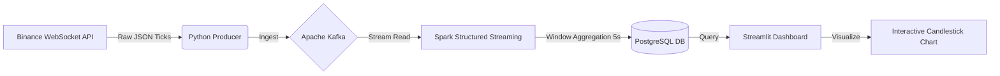

# 🚀 Real-Time Crypto Data Pipeline

## 📖 Overview
This project is an end-to-end data engineering pipeline that ingests, processes, and visualizes cryptocurrency trade data in real-time. It connects to the **Binance WebSocket API** to fetch live BTC/USDT trades, buffers them in **Apache Kafka**, processes them using **Spark Structured Streaming**, and stores the results in **PostgreSQL**.

The final output is a low-latency **Streamlit Dashboard** that visualizes price trends using 5-second sliding windows and OHLC (Open-High-Low-Close) aggregation.

## 🏗️ Architecture
The pipeline is fully containerized and runs on a Docker network.

🛠️ Tech Stack
Source: Binance WebSocket API (Asyncio)

Ingestion: Apache Kafka & Zookeeper (running on Docker)

Processing: PySpark (Structured Streaming) with Window Functions

Storage: PostgreSQL (JDBC Sink)

Visualization: Streamlit, Plotly (Candlestick Charts), Streamlit Autorefresh

Infrastructure: Docker Compose, WSL2 (Ubuntu Linux)

✨ Key Features
Real-Time OHLCV Aggregation: Spark transforms raw tick data into 5-second Open-High-Low-Close-Volume candles.

Smart Visualization: Streamlit dashboard uses uirevision to maintain zoom state while data updates live (no jitter).

Robust Timezone Handling: Enforced UTC across JVM, Docker Containers, and Python scripts to prevent timestamp mismatches.

Fault Tolerance: Spark handles late data arrivals and micro-batch failures automatically.

Dynamic Windowing: Dashboard allows users to adjust lookback periods (e.g., 10 min, 1 hour) and bucket sizes dynamically.

🚀 How to Run
1. Prerequisites
Docker & Docker Compose

Python 3.8+

Java 17 (Required for Spark 3.5.0)

2. Start Infrastructure
Spin up the Kafka, Zookeeper, and PostgreSQL containers:
Bash
docker-compose up -d
3. Install Dependencies
Set up a virtual environment and install the required Python libraries:

Bash
python3 -m venv venv
source venv/bin/activate
pip install -r requirements.txt
4. Run the Pipeline
Open 3 separate terminals to launch the components:

Terminal 1: Start Producer (Ingestion) This script connects to Binance and pushes trades to Kafka.

Bash
python producer.py
Terminal 2: Start Processor (ETL) This script reads from Kafka, aggregates data, and writes to Postgres.

Bash
python processor.py
Terminal 3: Launch Dashboard This script visualizes the data in your browser.

Bash
streamlit run dashboard.py --server.address 0.0.0.0
📂 Project Structure
Plaintext
├── dashboard.py       # Streamlit visualization & Plotly charts
├── docker-compose.yml # Infrastructure definition (Kafka, Zookeeper, Postgres)
├── producer.py        # Connects to Binance -> Writes to Kafka
├── processor.py       # Spark Streaming logic (Kafka -> Postgres)
├── requirements.txt   # Python dependencies
└── README.md          # Project documentation
🔧 Engineering Challenges Solved
Docker Networking: Configured internal service discovery so Spark (running locally) could communicate with Kafka brokers (running in Docker) using port mapping and advertised listeners.

Zombie Containers: Solved "broker ID mismatch" issues by ensuring clean container shutdowns and volume management.

Spark-Kafka Integration: Managed specific JAR dependencies (spark-sql-kafka-0-10) to ensure compatibility between Spark 3.5 and Kafka.

🔮 Future Improvements
Deployment: Deploy the pipeline to AWS (EC2 for Kafka, EMR for Spark).

Alerting: Add a separate microservice to send Telegram/Discord alerts when price crosses a threshold.

Machine Learning: Integrate a forecasting model to predict the next 5-second closing price.

