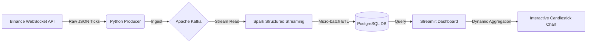

```markdown
# 🚀 Real-Time Crypto Data Pipeline


## 📖 Overview
This project is an end-to-end data engineering pipeline that processes cryptocurrency trade data in real-time. It ingests live Bitcoin trades from the **Binance WebSocket API**, buffers them in **Apache Kafka**, processes them using **Spark Structured Streaming**, and visualizes market trends on a low-latency **Streamlit Dashboard**.

The pipeline is designed to handle high-velocity data, enforcing schema validation, timezone consistency (UTC), and robust data persistence.

## 🏗️ Architecture
The entire infrastructure is containerized using Docker to ensure reproducibility.



## 🛠️ Tech Stack

* **Source:** Binance WebSocket API (Asyncio)
* **Ingestion:** Apache Kafka & Zookeeper (running on Docker)
* **Processing:** PySpark (Structured Streaming)
* **Storage:** PostgreSQL (JDBC Sink)
* **Visualization:** Streamlit, Plotly (Candlestick Charts), Streamlit Autorefresh
* **Infrastructure:** Docker Compose, WSL2 (Ubuntu Linux)

## ✨ Key Features

* **Real-Time Ingestion:** Python producer pushes live ticks to Kafka with sub-second latency.
* **Micro-batch Processing:** Spark Structured Streaming handles schema enforcement and writes micro-batches to PostgreSQL.
* **Dynamic Windowing:** Dashboard performs on-the-fly aggregation (e.g., 5s, 10s, 30s buckets) allowing users to explore different timeframes instantly.
* **Interactive Visualization:** Uses Plotly for zoomable, interactive financial charts with `uirevision` to maintain state during live updates.
* **Robust Timezone Handling:** Enforced UTC across JVM, Docker Containers, and Python scripts to prevent timestamp mismatches.

## 🚀 How to Run

### 1. Prerequisites

* Docker & Docker Compose
* Python 3.8+
* Java 17 (Required for Spark 3.5.0)

### 2. Start Infrastructure

Spin up the Kafka, Zookeeper, and PostgreSQL containers:

```bash
docker-compose up -d

```

### 3. Install Dependencies

Set up a virtual environment and install the required Python libraries:

```bash
python3 -m venv venv
source venv/bin/activate
pip install -r requirements.txt

```

### 4. Run the Pipeline

Open 3 separate terminals to launch the components:

**Terminal 1: Start Producer (Ingestion)**
This script connects to Binance and pushes trades to Kafka.

```bash
python producer.py

```

**Terminal 2: Start Processor (ETL)**
This script reads from Kafka, validates data, and writes to Postgres.

```bash
python processor.py

```

**Terminal 3: Launch Dashboard**
This script visualizes the data in your browser.

```bash
streamlit run dashboard.py --server.address 0.0.0.0

```

## 📂 Project Structure

```text
├── dashboard.py       # Streamlit visualization & Plotly charts
├── docker-compose.yml # Infrastructure definition (Kafka, Zookeeper, Postgres)
├── producer.py        # Connects to Binance -> Writes to Kafka
├── processor.py       # Spark Streaming logic (Kafka -> Postgres)
├── requirements.txt   # Python dependencies
└── README.md          # Project documentation

```

## 🔧 Engineering Challenges Solved

1. **Docker Networking:** Configured internal service discovery so Spark (running locally) could communicate with Kafka brokers (running in Docker) using port mapping and advertised listeners.
2. **Zombie Containers:** Solved "broker ID mismatch" issues by ensuring clean container shutdowns and volume management.
3. **Spark-Kafka Integration:** Managed specific JAR dependencies (`spark-sql-kafka-0-10`) to ensure compatibility between Spark 3.5 and Kafka.

## 🔮 Future Improvements

* **Deployment:** Deploy the pipeline to AWS (EC2 for Kafka, EMR for Spark).
* **Alerting:** Add a separate microservice to send Telegram/Discord alerts when price crosses a threshold.
* **Machine Learning:** Integrate a forecasting model to predict the next 5-second closing price.

```

```
